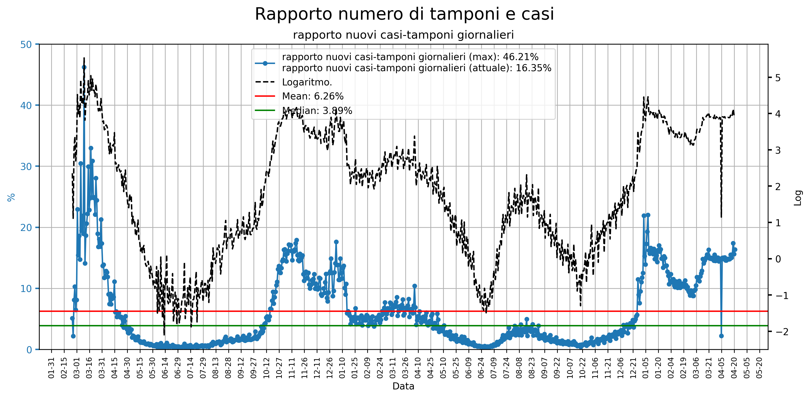

# Covid-19 Worldwide and italian statistics
Worldwide and italian diagrams are generated respectively by using the <a href="https://github.com/pcm-dpc/COVID-19">Protezione Civile dataset</a> and data taken from <a href="https://github.com/CSSEGISandData/COVID-19">2019 Novel Coronavirus COVID-19 (2019-nCoV) Data Repository by Johns Hopkins CSSE</a>.

Here a preview of statistics computed by using the code in <a href="https://github.com/Strato75/Covid-19_ItalyStats">this</a> repository.

Click on an image to get its full size version.

### Worldwide:
#### Aggregate data:

#### Per country statistics:

### Italy:
#### Whole nation statistics:

  

#### Per region statistics:

#### Per region detailed statistics:

<table>
  <tbody>
    <tr>
      <td><a href="notebooks/figures/regions/Abruzzo_whole_stats.png">Abruzzo</a></td>
      <td><a href="notebooks/figures/regions/Basilicata_whole_stats.png">Basilicata</a></td>
      <td><a href="notebooks/figures/regions/Calabria_whole_stats.png">Calabria</a></td>
      <td><a href="notebooks/figures/regions/Campania_whole_stats.png">Campania</a></td>
    </tr>
    <tr>
       <td><a href="notebooks/figures/regions/Emilia Romagna_whole_stats.png">Emilia Romagna</a></td>
      <td><a href="notebooks/figures/regions/Friuli Venezia Giulia_whole_stats.png">Friuli Venezia Giulia</a></td>
      <td><a href="notebooks/figures/regions/Lazio_whole_stats.png">Lazio</a></td>
      <td><a href="notebooks/figures/regions/Liguria_whole_stats.png">Liguria</a></td>
    </tr>
    <tr>
      <td><a href="notebooks/figures/regions/Lombardia_whole_stats.png">Lombardia</a></td>
      <td><a href="notebooks/figures/regions/Marche_whole_stats.png">Marche</a></td>
      <td><a href="notebooks/figures/regions/Molise_whole_stats.png">Molise</a></td>
      <td><a href="notebooks/figures/regions/Piemonte_whole_stats.png">Piemonte</a></td>
    </tr>
    <tr>
      <td><a href="notebooks/figures/regions/Puglia_whole_stats.png">Puglia</a></td>
      <td><a href="notebooks/figures/regions/Sardegna_whole_stats.png">Sardegna</a></td>
      <td><a href="notebooks/figures/regions/Sicilia_whole_stats.png">Sicilia</a></td>
      <td><a href="notebooks/figures/regions/Toscana_whole_stats.png">Toscana</a></td>
    </tr>
    <tr>
      <td><a href="notebooks/figures/regions/Trentino-Alto Adige_whole_stats.png">Trentino-Alto Adige</a></td>
      <td><a href="notebooks/figures/regions/Umbria_whole_stats.png">Umbria</a></td>
      <td><a href="notebooks/figures/regions/Valle d'Aosta_whole_stats.png">Valle d'Aosta</a></td>
      <td><a href="notebooks/figures/regions/Veneto_whole_stats.png">Veneto</a></td>
    </tr>
  </tbody>
</table>

#### Per province statistics:

<a href="notebooks/figures/province_choropleth_map.html">Choropleth map: Total cases per province</a>

<a href="notebooks/figures/province_choropleth_map_normalized.html">Choropleth map: Cases per 100000 inhabitants per province</a>

To see time evolution of covid-19 in each province, move the slider on the top of the pages of the following links:

<a href="notebooks/figures/timesliderchoroplet_prov_totcasi.html">Time evolution choropleth map: Total cases per province</a>

<a href="notebooks/figures/timesliderchoroplet_prov_totcasi_norm.html">Time evolution choropleth map: Cases per 100000 inhabitants per province</a>

##### Contributor:
Giovanni Busonera
