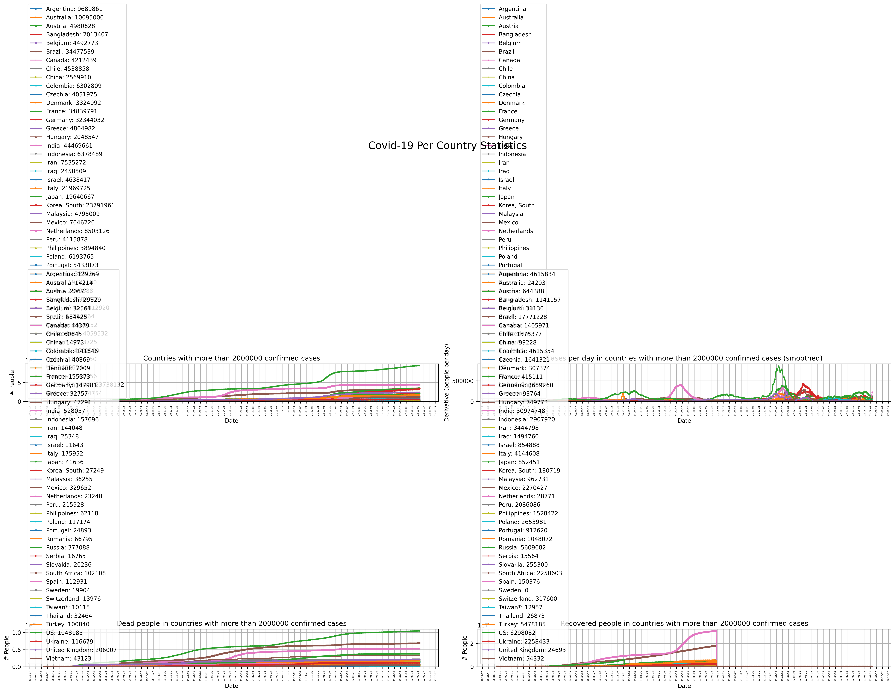

# Covid-19 Worldwide and italian statistics
Worldwide and italian diagrams are generated respectively by using the <a href="https://github.com/pcm-dpc/COVID-19">Protezione Civile dataset</a> and data taken from <a href="https://github.com/CSSEGISandData/COVID-19">2019 Novel Coronavirus COVID-19 (2019-nCoV) Data Repository by Johns Hopkins CSSE</a>.

Here a preview of statistics computed by using the code in <a href="https://github.com/Strato75/Covid-19_ItalyStats">this</a> repository.

Click on an image to get its full size version.

### Worldwide:
#### Aggregate data:

#### Per country statistics:

### Italy:
### Whole nation statistics:

#### Per region statistics:

#### Per province statistics:

<a href="notebooks/figures/province_choropleth_map.html">Choropleth map: Total cases per province</a>

<a href="notebooks/figures/province_choropleth_map_normalized.html">Choropleth map: Cases per 100000 inhabitants per province</a>

<a href="notebooks/figures/timesliderchoroplet_prov_totcasi.html">Time evolution choropleth map: Total cases per province</a>

<a href="notebooks/figures/timesliderchoroplet_prov_totcasi_norm.html">Time evolution choropleth map: Cases per 100000 inhabitants per province</a>

##### Contributor:
Giovanni Busonera
