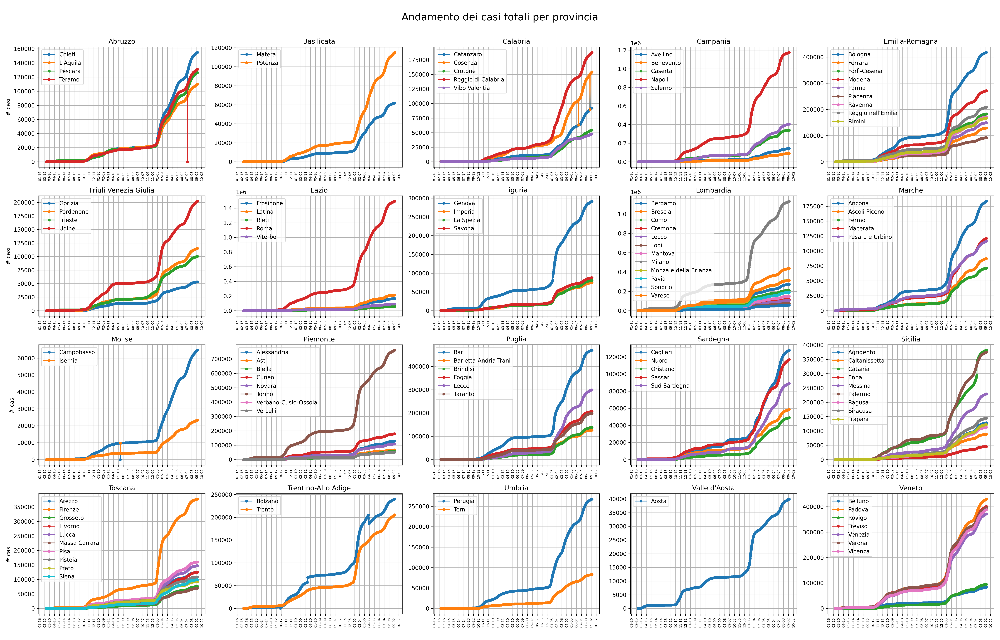

# Covid-19_ItalyStats
Jupyter notebooks to create diagrams about Covid-19 epidemics in Italy by using the Protezione Civile dataset (https://github.com/pcm-dpc/COVID-19). 
International data taken from: https://github.com/CSSEGISandData/COVID-19

Here a preview of statistics computed by using the code in this repository:

Worldwide statistics:

Per country statistics:

Italian Statistics:

Per region statistics:

Per province statistics:

